# Introducción a los contenedores y a Docker

Los contenedores son una tecnología clave en el desarrollo y despliegue moderno de software, ya que permiten ejecutar aplicaciones y sus dependencias en un entorno aislado y reproducible. Docker es una plataforma que simplifica la creación, gestión y distribución de estos contenedores, convirtiéndose en un estándar de facto en la industria.

En esta práctica, nos centraremos en comprender el concepto de contenedores y cómo Docker facilita su uso. Exploraremos cómo los contenedores proporcionan una alternativa ligera a las máquinas virtuales al compartir el kernel del sistema operativo, manteniendo al mismo tiempo el aislamiento necesario para ejecutar múltiples aplicaciones en paralelo sin interferencias.

## Contenido

- [Introducción a los contenedores y a Docker](#introducción-a-los-contenedores-y-a-docker)
  - [Contenido](#contenido)
  - [Instalación de docker](#instalación-de-docker)
  - [El “Hola Mundo” de docker](#el-hola-mundo-de-docker)
  - [Ejecución simple de contenedores](#ejecución-simple-de-contenedores)
  - [Ejecutando un contenedor interactivo](#ejecutando-un-contenedor-interactivo)
  - [Creando un contenedor demonio](#creando-un-contenedor-demonio)
  - [Creando un contenedor con un servidor web](#creando-un-contenedor-con-un-servidor-web)
  - [Configuración de contenedores con variables de entorno](#configuración-de-contenedores-con-variables-de-entorno)

## Instalación de docker
Para instalar Docker en Kali, debe recordar que ya hay un paquete llamado `docker`, por lo tanto, Docker debe instalarse con un nombre diferente. Si instala docker, no terminará con la versión del contenedor. La versión que instalaremos se llama `docker.io`. Sin embargo, todos los comandos son iguales, por lo que ejecutar docker en la línea de comandos será el comando apropiado:
   ```bash
sudo apt update
sudo apt install -y docker.io
sudo systemctl enable docker --now
docker
   ```

Ahora puede comenzar a usar `docker`, con `sudo`, pero si desea agregarse al grupo docker para usar docker sin `sudo`, se necesita un paso adicional:

   ```bash
sudo usermod -aG docker $USER
   ```

## El “Hola Mundo” de docker
Vamos a comprobar que todo funciona creando nuestro primer contenedor desde la imagen `hello-world`:

   ```bash
docker run hello-world
   ```

Este comando lo que hacer es correr un contenedor con el script llamado `hello-world`, que lo que hace es imprimir este mensaje:

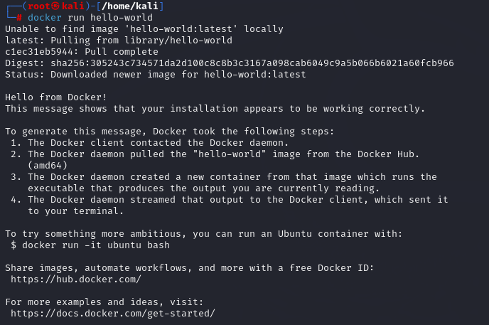
</p>
<p align="center"><em>lanzar script hello-world</em></p>

Al ser la primera vez que ejecuto un contenedor basado en esa imagen, la imagen hello-word se descarga desde el repositorio que se encuentra en el registro que vayamos a utilizar, en nuestro caso DockerHub.

A continuación, listamos los contenedores que se están ejecutando:
   ```bash
docker ps
   ```


</p>
<p align="center"><em>listar contenedores en ejecución</em></p>

Como podemos comprobar, este contenedor no se está ejecutando. Esto es porque un contenedor ejecuta un proceso y cuando termina la ejecución, el contenedor se para. Para ver los contenedores que no se están ejecutando:
   ```bash
docker ps -a
   ```


</p>
<p align="center"><em>listar contenedores que no están en ejecución</em></p>

Para eliminar el contenedor podemos identificarlo con su id o por su nombre:
   ```bash
docker rm 231c27b7f265
docker rm youthful_khorana
   ```

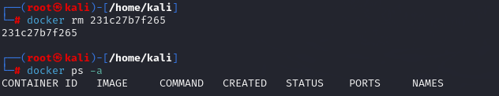
</p>
<p align="center"><em>Eliminar contenedor</em></p>

## Ejecución simple de contenedores
El comando `run` nos sirve para crear y gestionar contenedores a partir de imágenes. En este caso, trabajaremos con una imagen de Ubuntu para comprender cómo Docker ejecuta comandos dentro de los contenedores y cómo podemos verificar su estado y gestionar las imágenes descargadas.

Este comando nos permite crear un contenedor y, al mismo tiempo, ejecutar un comando en su interior. En este ejemplo, vamos a crear un contenedor basado en la imagen de Ubuntu, la cual se descargará automáticamente desde Docker Hub si aún no la tenemos en nuestro sistema. El comando nos permitirá ver cómo Docker gestiona automáticamente la descarga de la imagen necesaria y ejecuta el comando dentro del contenedor recién creado:
   ```bash
docker run ubuntu echo 'Hello world'
   ```
Al ejecutar este comando, si la imagen de Ubuntu aún no está disponible localmente, Docker procederá a descargarla desde Docker Hub. El proceso de descarga se indica mediante mensajes como en el caso de [hello-wolrd](Sesion_1.md#el-hola-mundo-de-docker):
   ```vbnet
Unable to find image 'ubuntu:latest' locally
latest: Pulling from library/ubuntu
8387d9ff0016: Pull complete
...
Status: Downloaded newer image for ubuntu:latest
Hello world
   ```

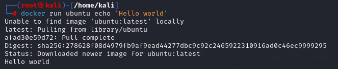
</p>
<p align="center"><em>Ejecutar docker run y comando echo</em></p>

Una vez que la imagen se ha descargado y el comando echo 'Hello world' se ejecuta dentro del contenedor, podemos ver el resultado en la salida del terminal: "Hello world". Esto indica que el contenedor se creó, ejecutó el comando y luego se detuvo automáticamente.

Podemos verificar el estado del contenedor utilizando el comando `docker ps -a`, que vimos anteriormente: 

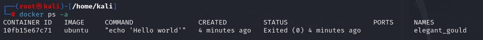
</p>
<p align="center"><em>Comprobación del contenedor creado con el comando echo</em></p>

Aquí podemos ver que el contenedor basado en la imagen ubuntu ejecutó el comando echo 'Hello world' y se encuentra en estado "Exited (0)", lo que indica que finalizó correctamente.

A continuación, podemos listar todas las imágenes que hemos descargado en nuestro registro local con el comando `docker images`. Este comando nos muestra información sobre las imágenes disponibles, incluyendo el repositorio, la etiqueta (tag), el ID de la imagen, la fecha de creación y el tamaño de la imagen. Al ejecutar el comando, obtenemos una salida como esta:

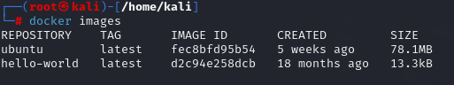
</p>
<p align="center"><em>Ejecución comando docker images</em></p>

En este caso, vemos que la imagen de ``Ubuntu``, etiquetada como ``latest``, ya está descargada en nuestro sistema junto con la imagen ``hello-world``.

## Ejecutando un contenedor interactivo
Ahora, exploraremos cómo ejecutar un contenedor interactivo en Docker utilizando las opciones adecuadas para interactuar directamente con el sistema operativo que corre dentro del contenedor. Aprenderemos a iniciar, detener, reiniciar y ejecutar comandos dentro de un contenedor existente, además de cómo inspeccionar sus configuraciones y detalles técnicos.

Para comenzar, ejecutaremos un contenedor interactivo. Utilizamos la opción ``-i`` para habilitar la interacción con el contenedor, mientras que ``-t`` crea un pseudo-terminal que nos permite trabajar con la sesión interactiva. También usamos la opción ``--name`` para asignar un nombre al contenedor, facilitando su referencia en comandos posteriores. En este caso, utilizaremos la imagen ubuntu para crear el contenedor e indicaremos que queremos ejecutar el comando ``bash`` para iniciar una sesión Bash dentro del contenedor.

   ```bash
docker run -it --name contenedor1 ubuntu bash
   ```
Al ejecutar este comando, se nos presenta un prompt de Bash dentro del contenedor:
   ```ruby
root@2bfa404bace0:/#
   ```

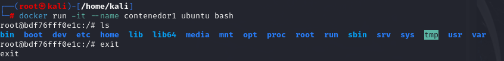
</p>
<p align="center"><em>Ejecutar contenedor interactivo</em></p>

Mientras estamos dentro del contenedor, podemos ejecutar comandos directamente en la terminal de Bash. El contenedor continuará funcionando hasta que salgamos de él, momento en el que se detendrá automáticamente.

Es importante notar que todas las imágenes tienen definido un proceso principal que se ejecuta al utilizar el ``comando docker`` run. En el caso de la imagen ``ubuntu``, el proceso por defecto es ``bash``. Por ello, podríamos haber iniciado este contenedor sin especificar el comando ``bash``, ya que es el predeterminado

   ```bash
docker run -it --name contenedor1 ubuntu
   ```

Si deseamos volver a conectarnos a este contenedor después de haber salido, primero debemos iniciarlo con el comando ``docker start``, seguido de ``docker attach`` para volver a interactuar con él:

</p>
<p align="center"><em>Iniciar y conectarse a contenedor</em></p>

Si el contenedor está en ejecución, también podemos ejecutar comandos directamente sin necesidad de acceder al contenedor utilizando el subcomando ``exec``, pero solo se ejecutaría el comando de la linea escrita. Por ejemplo, si queremos listar los archivos dentro del contenedor, podemos hacerlo de esta manera:
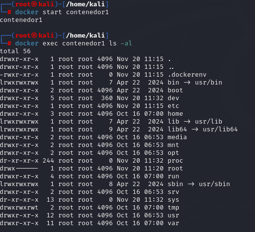
</p>
<p align="center"><em>Comando exec</em></p>

Con el comando ``docker restart``, podemos reiniciar el contenedor rápidamente. Esto implica detenerlo y luego iniciarlo de nuevo en un solo paso. Para obtener información detallada sobre un contenedor, usamos el comando ``docker inspect``, que nos devuelve una salida en formato JSON. Este formato contiene información útil, como:

</p>
<p align="center"><em>Comando inspect</em></p>
Dentro de esta información, podemos encontrar:

- El identificador único del contenedor (ID).
- Los puertos abiertos y sus redirecciones.
- Los volúmenes y directorios montados (bind mounts).
- El tamaño del contenedor.
- La configuración de red del contenedor.
- El ``ENTRYPOINT``, que define el proceso que se ejecuta al iniciar el contenedor.
- Las variables de entorno configuradas dentro del contenedor.

## Creando un contenedor demonio
Ahora vamos a crear y gestionar un contenedor que se ejecute en segundo plano, también conocido como contenedor en modo demonio, utilizando la opción ``-d`` del comando ``docker run``. Esto permite que el contenedor se ejecute de manera continua en el fondo, sin ocupar la terminal. Para iniciar el contenedor en modo demonio, utilizamos el siguiente comando. Aquí, especificamos el nombre del contenedor con la opción ``--name`` y usamos la imagen de ``ubuntu``. Además, ejecutamos un comando dentro del contenedor utilizando ``bash -c``, lo que nos permite ejecutar comandos más complejos. En este caso, se ejecutará un bucle infinito que imprime "hello world" cada segundo.

   ```bash
docker run -d --name contenedor2 ubuntu bash -c "while true; do echo hello world; sleep 1; done"
   ```

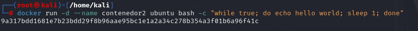
</p>
<p align="center"><em>Levantar contenedor como demonio que imprima infinitamente "hello world"</em></p>

Al ejecutar este comando, Docker nos devuelve el identificador único del contenedor, lo que confirma que el contenedor se ha creado y está ejecutándose en segundo plano. La instrucción ``bash -c`` nos permite definir uno o varios comandos dentro del contenedor, en este caso un bucle infinito, que es ideal para tareas que deben ejecutarse de forma constante. Para confirmar que el contenedor se encuentra ejecutándose, podemos usar el comando docker ps, que muestra una lista de todos los contenedores activos en el sistema.

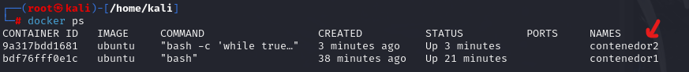
</p>
<p align="center"><em>Comprobación de que está activo el contenedor demonio</em></p>

Podemos inspeccionar lo que el contenedor está haciendo en tiempo real utilizando el comando docker logs. Este comando muestra la salida estándar generada por el contenedor. En este caso, verificaremos que está imprimiendo "hello world" en cada iteración del bucle:

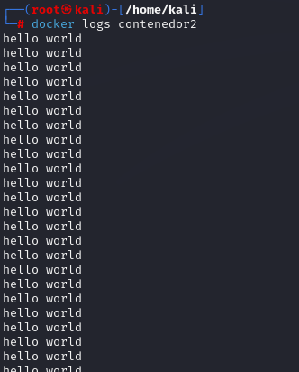
</p>
<p align="center"><em>Logs del contenedor demonio</em></p>

Si queremos detener el contenedor, utilizamos el comando ``docker stop``, seguido del nombre o ID del contenedor. Esto detendrá su ejecución. Después de detener el contenedor, podemos eliminarlo con el comando ``docker rm``:

   ```bash
docker stop contenedor2
docker rm contenedor2
   ```

> **Nota**: Es importante tener en cuenta que Docker no permite eliminar un contenedor que está en ejecución. Si intentamos hacerlo, obtendremos un error. 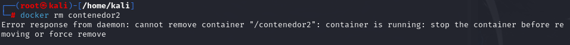
</p>

> Por eso, es necesario detener el contenedor primero. Sin embargo, si deseamos eliminar un contenedor en ejecución directamente, podemos hacerlo utilizando la opción ``-f`` (force, para forzar la eliminación):   
> ```bash
> docker rm -f contenedor2
> ```

## Creando un contenedor con un servidor web
En este apartado, vamos a crear un contenedor que ejecute un servidor web utilizando Apache 2.4. Aprovecharemos las opciones de mapeo de puertos para hacer que el servidor web sea accesible desde nuestro navegador y exploraremos cómo modificar el contenido del servidor directamente en el contenedor.

Para crear el servidor web, utilizaremos la imagen oficial de Apache disponible en Docker Hub (httpd:2.4). Usamos el comando ``docker run`` con la opción ``-d`` para que el contenedor se ejecute en segundo plano. Además, con la opción ``-p``, mapeamos un puerto de nuestro equipo anfitrión (en este caso, el 8080) al puerto 80 del contenedor, que es donde Apache escucha por defecto.

   ```bash
docker run -d --name my-apache-app -p 8080:80 httpd:2.4
   ```

El contenedor se ejecutará, y al acceder desde un navegador a la dirección IP del equipo que tiene instalado Docker, en el puerto 8080, podremos ver la página web que está sirviendo Apache. El mapeo de puertos funciona redirigiendo el tráfico desde el puerto 8080 de la máquina anfitriona al puerto 80 del contenedor. Para comprobar que el servidor Apache está sirviendo contenido, abrimos un navegador web y accedemos a la IP de la máquina en el puerto 8080, por ejemplo

   ```plaintext
http://localhost:8080/
   ```

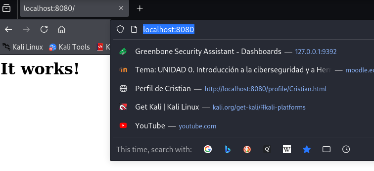
</p>
<p align="center"><em>Comprobación de que el servidor está levantado</em></p>

Podemos inspeccionar los logs generados por Apache en el contenedor usando el comando ``docker logs`` y para seguir visualizando los logs en tiempo real, usamos la opción ``-f``:

   ```bash
docker logs my-apache-app
docker logs -f my-apache-app
   ```

Esto es útil para monitorear el tráfico o errores que el servidor Apache pueda estar generando.

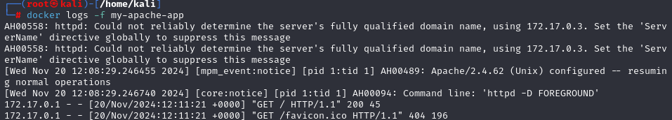
</p>
<p align="center"><em>Monitoreo del servidor</em></p>

Apache, por defecto, almacena los archivos del sitio web en el directorio ``/usr/local/apache2/htdocs/`` dentro del contenedor. Podemos modificar el contenido del servidor web creando o editando el archivo ``index.html`` en ese directorio. Existen 2 formas de hacerlo:

1. **Acceder al contenedor de forma interactiva**
Usamos el comando ``docker exec`` con las opciones ``-it`` para acceder al contenedor en modo interactivo. Esto nos permitirá navegar por el sistema de archivos del contenedor y modificar manualmente los archivos:

    ```bash
    docker exec -it my-apache-app bash
    ```
Una vez dentro del contenedor, navegamos al directorio donde Apache almacena sus archivos y creamos o modificamos el archivo ``index.html``:

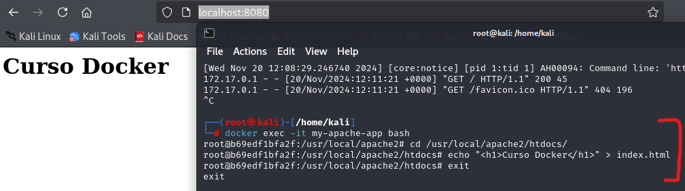
</p>
<p align="center"><em>Modificar index.html de forma interactiva</em></p>

2. **Ejecutar un comando directamente en el contenedor**
Otra forma de modificar el archivo es ejecutando un comando directamente sin necesidad de entrar al contenedor. Esto se hace con el comando ``docker exec`` seguido del comando que queremos ejecutar:

    ```bash
    docker exec my-apache-app bash -c 'echo "<h1>Segunda modificación</h1>" > /usr/local/apache2/htdocs/index.html'
    ```

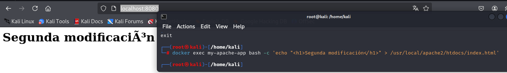
</p>
<p align="center"><em>Modificar index.html ejecutando un comando directamente sin entrar al contenedor</em></p>

## Configuración de contenedores con variables de entorno
A continuación, vamos a aprender cómo configurar contenedores utilizando variables de entorno, una funcionalidad muy útil en Docker para personalizar y parametrizar el comportamiento de las aplicaciones dentro de los contenedores. Además, veremos un ejemplo práctico con la imagen oficial de MariaDB, configurando un servidor de base de datos y accediendo a él tanto desde el contenedor como desde el exterior.

Las variables de entorno se pueden definir al crear un contenedor utilizando el flag ``-e`` o ``--env``. Esto es especialmente útil cuando queremos que el proceso dentro del contenedor acceda a configuraciones específicas. Veamos un ejemplo simple en el que creamos un contenedor de Ubuntu y definimos una variable de entorno llamada `USUARIO`. Dentro del contenedor, podemos verificar el valor de esta variable utilizando el comando ``echo``, por ejemplo:
   ```bash
docker run -it --name prueba -e USUARIO=prueba ubuntu bash
   ```

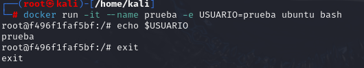
</p>
<p align="center"><em>Creación de variable de entorno</em></p>

Como se observa, la variable USUARIO se ha configurado correctamente y está disponible dentro del entorno del contenedor.

Cuando usamos imágenes específicas como ``mariadb``, en ocasiones es obligatorio definir ciertas variables de entorno para que el contenedor funcione correctamente. Según la documentación oficial de Docker Hub para MariaDB, es necesario definir variables como ``MYSQL_DATABASE``, ``MYSQL_USER``, y ``MYSQL_PASSWORD`` para la configuración. Sin embargo, una de estas variables es obligatoria: ``MYSQL_ROOT_PASSWORD``, que define la contraseña del usuario root. Para iniciar un contenedor con MariaDB y configurar esta variable obligatoria, ejecutamos:
   ```bash
docker run -d --name some-mariadb -e MYSQL_ROOT_PASSWORD=my-secret-pw mariadb
   ```

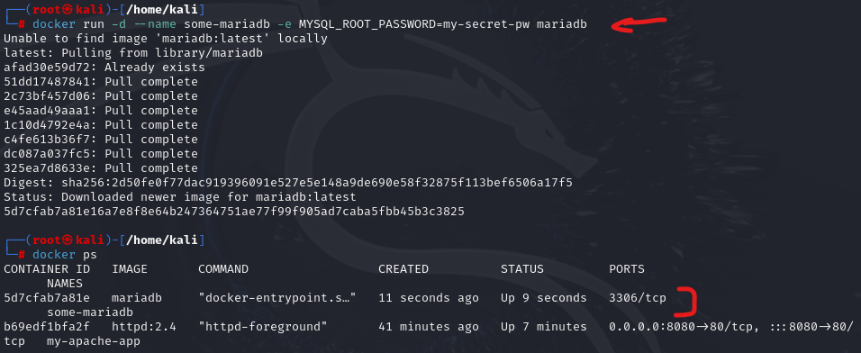
</p>
<p align="center"><em>Verificar que el contenedor MariaDB está en ejecución</em></p>

Para inspeccionar las variables de entorno configuradas dentro del contenedor, usamos el comando ``docker exec`` junto con ``env``:
   ```bash
docker exec -it some-mariadb env
   ```

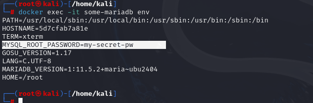
</p>
<p align="center"><em>Inspeccionar la variable de la contraseña en MariaDB</em></p>

Podemos acceder a la base de datos MariaDB ejecutar el cliente de MariaDB directamente en el contenedor. Como la imagen oficial de MariaDB no incluye herramientas como sudo ni el cliente mysql, porque esas imágenes están diseñadas para ser ligeras y enfocadas únicamente en ejecutar el servidor de MariaDB, es mejor idea ejecutarlo todo desde la máquina anfitriona. Una opción sería instalar herramientas como `sudo` o `mysql` para poder ejecutar los comandos dentro de la máquina MariaDB. Primero podemos instalarle la herramienta `mysql`:

   ```bash
docker exec -it some-mariadb apt update && apt install mariadb-client -y
   ```

Y luego dentro de la máquina usamos el cliente de MariaDB para conectarnos a la base de datos con las credenciales definidas:

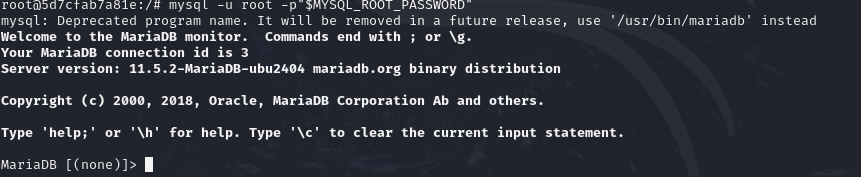
</p>
<p align="center"><em>Inspeccionar la base de datos de MariaDB</em></p>

Si queremos acceder a la base de datos desde fuera del contenedor, es necesario mapear los puertos entre el anfitrión y el contenedor. Primero, eliminamos el contenedor anterior con ``docker rm -f some-mariadb``. Luego, creamos un nuevo contenedor, mapeando el puerto 3306 del anfitrión al puerto 3306 del contenedor y verificamos:

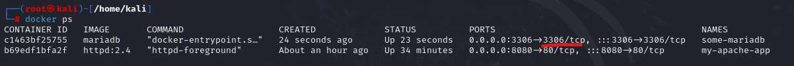
</p>
<p align="center"><em>Mapeo de puertos de MariaDB</em></p>

El mapeo de puertos asegura que podamos conectarnos al servidor MariaDB desde el exterior, usando un cliente de MariaDB instalado en nuestra máquina anfitriona. Por ejemplo, para conectarnos desde el equipo anfitrión, usamos la IP de la máquina Docker y el cliente de MariaDB. También podemos conectarnos usando la dirección ``127.0.0.1`` si estamos trabajando localmente.
