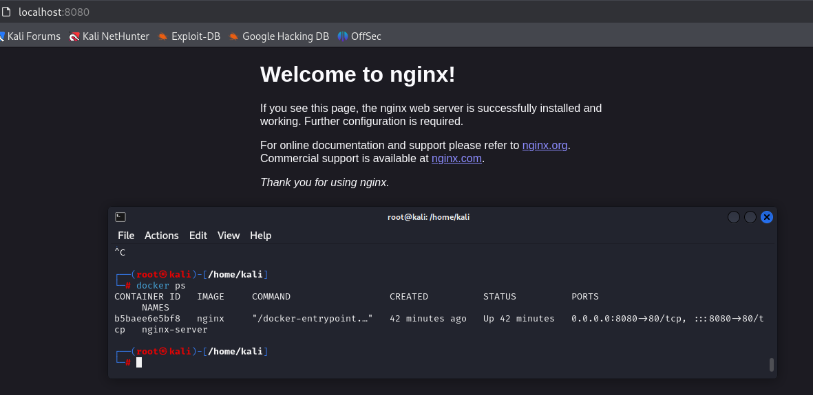

# Introducción a los contenedores y a Docker

Los contenedores son una tecnología clave en el desarrollo y despliegue moderno de software, ya que permiten ejecutar aplicaciones y sus dependencias en un entorno aislado y reproducible. Docker es una plataforma que simplifica la creación, gestión y distribución de estos contenedores, convirtiéndose en un estándar de facto en la industria.

En esta práctica, nos centraremos en comprender el concepto de contenedores y cómo Docker facilita su uso. Exploraremos cómo los contenedores proporcionan una alternativa ligera a las máquinas virtuales al compartir el kernel del sistema operativo, manteniendo al mismo tiempo el aislamiento necesario para ejecutar múltiples aplicaciones en paralelo sin interferencias.

# Ejercicios

- [Introducción a los contenedores y a Docker](#introducción-a-los-contenedores-y-a-docker)
- [Ejercicios](#ejercicios)
  - [Ejercicio 1](#ejercicio-1)
  - [Ejercicio 2](#ejercicio-2)
  - [Ejercicio 3](#ejercicio-3)
  - [Ejercicio 4](#ejercicio-4)

## Ejercicio 1
Vamos a crear un contenedor demonio con un servidor nginx, usando la imagen oficial de nginx. Al crear el contenedor, ¿has tenido que indicar algún comando para que lo ejecute? Accede al navegador web y comprueba que el servidor esta funcionando. Muestra los logs del contenedor. A mayores, muestra el pantallazo donde se vea la creación del contenedor y podamos comprobar que el contenedor está funcionando.

1. **Paso 1: Crear el contenedor demonio con Nginx**

Para crear el contenedor, utilizamos el comando ``docker run`` con la opción ``-d``, que ejecuta el contenedor en segundo plano (modo demonio). También podemos usar la opción ``--name`` para darle un nombre identificativo, en este caso ``nginx-server``. Como estamos usando la imagen oficial de Nginx, no necesitamos especificar ningún comando adicional, ya que el contenedor inicia automáticamente el servidor web al ejecutarse:

   ```bash
    docker run -d --name nginx-server -p 8080:80 nginx
   ```

En este caso, hemos mapeado el puerto ````80```` del contenedor al puerto ````8080```` de nuestra máquina anfitriona utilizando la opción ````-p````. Esto permite que podamos acceder al servidor web desde nuestro navegador a través del puerto ````8080````.

<p align="center">
    
    </p>
<p align="center"><em>Crear un contenedor Nginx demonio</em></p>

2. **Paso 2: Verificar que el contenedor está funcionando**

Después de crear el contenedor, comprobamos que está en ejecución utilizando el comando ``docker ps``. Este comando nos muestra una lista de los contenedores activos junto con detalles como el nombre, la imagen utilizada, el puerto mapeado y el estado.

   ```bash
    docker ps
   ```
La columna `PORTS` indica que el puerto `8080` del anfitrión está redirigiendo las solicitudes al puerto `80` del contenedor.

3. **Paso 3: Comprobar el funcionamiento en el navegador**

Abrimos un navegador web y accedemos a la dirección IP de la máquina anfitriona (o ``localhost`` si estamos trabajando localmente) en el puerto ``8080``. La URL que utilizaremos es:
   ```arduino
    http://localhost:8080
   ```

Si todo está funcionando correctamente, veremos la página predeterminada de Nginx con el mensaje "**Welcome to nginx!**", lo que confirma que el servidor web está operativo

<p align="center">
    
    </p>
<p align="center"><em>Verificar el estado de ejecución del contenedor Nginx demonio</em></p>

1. **Paso 4: Mostrar los logs del contenedor**

Para visualizar los logs generados por el servidor Nginx, utilizamos el comando ``docker logs`` seguido del nombre del contenedor (``nginx-server``). Este comando muestra la salida estándar del contenedor, incluyendo los registros de acceso y errores.

   ```bash
    docker logs nginx-server
   ```

Si queremos seguir viendo los logs en tiempo real, añadimos la opción ``-f``:

   ```bash
    docker logs -f nginx-server
   ```

<p align="center">
    
    </p>
<p align="center"><em>Logs del contenedor mostrados en la terminal</em></p>

En este ejercicio, hemos creado un contenedor demonio con un servidor Nginx utilizando la imagen oficial. Observamos que no necesitamos indicar ningún comando adicional al crear el contenedor, ya que la imagen tiene preconfigurado un ``ENTRYPOINT`` que ejecuta automáticamente el servidor web. Verificamos su funcionamiento accediendo al servidor desde el navegador y revisando sus logs con el comando ``docker logs``. Este ejercicio nos ha permitido familiarizarnos con el uso de imágenes oficiales y el despliegue de aplicaciones en contenedores Docker.

## Ejercicio 2

Para poder ver el acceso al servidor web utilizando un navegador web haremos uso de un buscador, en este caso firefox, que viene instalado por defecto en la máquina anfitrión:

<p align="center">
    
</p>
<p align="center"><em>Verificar el estado de ejecución del contenedor Nginx demonio</em></p>

## Ejercicio 3
Utilizamos el comando docker images para listar todas las imágenes disponibles en el registro local. Esto muestra información como el nombre de la imagen, la etiqueta (versión), el ID de la imagen, la fecha de creación y el tamaño:

   ```bash
docker images
   ```

<p align="center">
    
</p>
<p align="center"><em>Pantallazo de las imágenes en el registro local</em></p>

## Ejercicio 4
Antes de eliminar un contenedor, es necesario detenerlo si está en ejecución. Utiliza los siguientes comandos en orden:

1. **Detener el contenedor**

Si el contenedor está en ejecución, detenlo con el siguiente comando (sustituyendo ``nginx-server`` por el nombre del contenedor):

   ```bash
    docker stop nginx-server
   ```

2. **Eliminar el contenedor**

Una vez detenido, podemos eliminarlo usando:

   ```bash
    docker rm nginx-server
   ```

3. **Eliminar forzadamente, otra opción**

Si el contenedor está ejecutándose y quieres eliminarlo directamente, utiliza la opción ``-f``:

   ```bash
    docker rm -f nginx-server
   ```

<p align="center">
    
</p>
<p align="center"><em>Pantallazo de la eliminación del contenedor, primera opción</em></p>