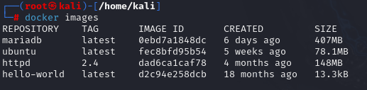
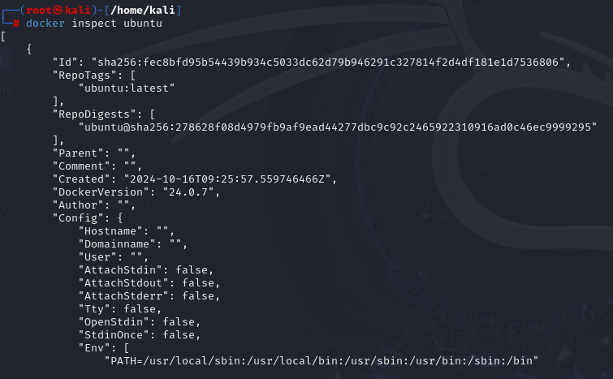

# Imagenes Docker

Las imágenes Docker son plantillas de solo lectura que sirven como base para crear contenedores. Cada imagen incluye el sistema de archivos y las configuraciones necesarias para ejecutar aplicaciones, como un sistema operativo (por ejemplo, Debian) o software preinstalado. Sin embargo, cualquier cambio realizado en un contenedor creado a partir de una imagen no afecta a la imagen original, ya que esta permanece inmutable. Esto asegura consistencia y reutilización, permitiendo crear múltiples contenedores idénticos a partir de una misma imagen.

Un registro de imágenes en Docker es un componente esencial para almacenar y gestionar las imágenes creadas con el Docker Engine. Este registro puede instalarse en un servidor independiente o utilizar servicios públicos como Docker Hub. Es una herramienta fundamental para distribuir aplicaciones en entornos Docker, ya que permite compartir, descargar y gestionar imágenes de manera eficiente.

Docker Hub, ofrecido como un servicio oficial por Docker, es el registro público más utilizado y accesible. Sin embargo, Docker también permite instalar registros privados de manera gratuita en cualquier servidor, utilizando su proyecto open source.

# Ejercicios

- [Imagenes Docker](#imagenes-docker)
- [Ejercicios](#ejercicios)
  - [Ejercicio 1: Servidor web](#ejercicio-1-servidor-web)
  - [Ejercicio 2: Servidor de base de datos](#ejercicio-2-servidor-de-base-de-datos)
  - [¿Cómo se organizan las imágenes?](#cómo-se-organizan-las-imágenes)
  - [Creación de contenedores desde imágenes](#creación-de-contenedores-desde-imágenes)
  - [Ejemplo: Desplegando la aplicación mediawiki](#ejemplo-desplegando-la-aplicación-mediawiki)
  - [Ejercicios](#ejercicios-1)


## Ejercicio 1: Servidor web
El objetivo es crear un contenedor llamado web utilizando la imagen ``php:7.4-apache``, accesible desde el puerto ``8000``. Añadiremos los archivos ``index.html`` e ``index.php`` al directorio raíz del servicio web (``/var/www/html``).

1. **Crear el contenedor**

Usamos el siguiente comando para crear y arrancar el contenedor:

   ```bash
    docker run -d --name web -p 8000:80 php:7.4-apache
   ```

sdfag

2. **Crear el archivo ``index.html``**

Añadimos un archivo ``index.html`` con el contenido ``<h1>HOLA SOY CRISTIAN</h1>``. Puedes hacerlo de una de las tres maneras descritas:
- **Opción 1: Accediendo al contenedor**
Entramos al contenedor de manera interactiva:

   ```bash
    docker exec -it web bash
   ```
Una vez dentro, creamos el archivo:

   ```bash
    echo "<h1>HOLA SOY [Tu Nombre]</h1>" > /var/www/html/index.html
   ```

- **Opción 2: Usando ``docker exec``**
Ejecutamos directamente el comando sin acceder al contenedor:

   ```bash
    docker exec web bash -c 'echo "<h1>HOLA SOY CRISTIAN</h1>" > /var/www/html/index.html'
   ```

- **Opción 3: Usando ``docker cp``**
Creamos el archivo en nuestra máquina local:

   ```bash
    echo "<h1>HOLA SOY CRISTIAN</h1>" > index.html
   ```
Luego copiamos el archivo al contenedor:

   ```bash
    docker cp index.html web:/var/www/html/
   ```

3. **Crear el archivo`` index.php``**

Repetimos el procedimiento para crear el archivo ``index.php`` con el contenido ``<?php echo phpinfo(); ?>``

- **Opción 1: Dentro del contenedor**
   ```bash
    echo "<?php echo phpinfo(); ?>" > /var/www/html/index.php
   ```

- **Opción 2: Usando ``docker exec``**

   ```bash
    docker exec web bash -c 'echo "<?php echo phpinfo(); ?>" > /var/www/html/index.php'
   ```

- **Opción 3: Usando ``docker cp``**

   ```bash
    echo "<?php echo phpinfo(); ?>" > index.php
    docker cp index.php web:/var/www/html/
   ```

4. **Verificar el contenido desde el navegador**

Accede a los archivos desde el navegador:

- ``http://localhost:8000/index.html`` para el archivo HTML.
- ``http://localhost:8000/index.php`` para el archivo PHP.


## Ejercicio 2: Servidor de base de datos
En Docker, las imágenes son un componente fundamental para crear y ejecutar contenedores. Antes de iniciar un contenedor, es necesario disponer de la imagen correspondiente en el registro local. Si al ejecutar el comando docker run la imagen no está disponible, Docker procederá automáticamente a descargarla desde un registro como Docker Hub. La gestión de imágenes permite realizar operaciones clave como listar, descargar, eliminar, buscar o inspeccionar imágenes, facilitando así el control sobre los recursos disponibles y utilizados en nuestro entorno Docker.

Los principales comandos serían:
- `Docker images`: Este comando muestra una lista de todas las imágenes disponibles en nuestro registro local. Proporciona información como el nombre del repositorio, la etiqueta (versión), el ID de la imagen, la fecha de creación y su tamaño:

<p align="center">
    
    </p>
<p align="center"><em>Listar imágenes</em></p>

- `Docker pull`:Este comando descarga una imagen desde un registro remoto, como Docker Hub. Si no se especifica una etiqueta, Docker descargará la versión etiquetada como latest.


- `Docker rmi`:

- `Docker search`:

- `docker inspect`: Proporciona información detallada sobre una imagen específica, en formato JSON. Entre los datos más importantes que podemos obtener se incluyen:

    - ID y checksum de la imagen: Identificadores únicos de la imagen.
    - Puertos abiertos: Información sobre los puertos expuestos.
    - Sistema operativo y arquitectura: Detalles del entorno en el que se ejecutará la imagen.
    - Tamaño: El peso de la imagen en el disco.
    - Volúmenes: Directorios que se montan en el contenedor.
    - ENTRYPOINT: Comando o proceso que se ejecuta al iniciar el contenedor.
    - Capas: Las distintas capas que forman la imagen

<p align="center">
    
    </p>
<p align="center"><em>Inspeccionar la imagen de Ubuntu</em></p>


## ¿Cómo se organizan las imágenes?

imagen Crear_contenedor_desde_imagen añadir que es interactivo
imagen Visualizar_tamaño_contenedor
imagen Crear_archivo_ver_tamaño_ahora
imagen Capas_latest

## Creación de contenedores desde imágenes

Imagen Crear_con_comando_en_creacion
Imagen Servidor_htttp_80
Eliminar_contenedores_no_activos (no borra las imagenes, por lo que siguen ocupando espacio)

## Ejemplo: Desplegando la aplicación mediawiki

Imagen Descargar_imagen
Imagen Correr_imagen_p8081 (debe ser en un puerto libre claramente)

## Ejercicios