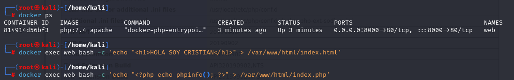

# Imagenes Docker

Las imágenes Docker son plantillas de solo lectura que sirven como base para crear contenedores. Cada imagen incluye el sistema de archivos y las configuraciones necesarias para ejecutar aplicaciones, como un sistema operativo (por ejemplo, Debian) o software preinstalado. Sin embargo, cualquier cambio realizado en un contenedor creado a partir de una imagen no afecta a la imagen original, ya que esta permanece inmutable. Esto asegura consistencia y reutilización, permitiendo crear múltiples contenedores idénticos a partir de una misma imagen.

Un registro de imágenes en Docker es un componente esencial para almacenar y gestionar las imágenes creadas con el Docker Engine. Este registro puede instalarse en un servidor independiente o utilizar servicios públicos como Docker Hub. Es una herramienta fundamental para distribuir aplicaciones en entornos Docker, ya que permite compartir, descargar y gestionar imágenes de manera eficiente.

Docker Hub, ofrecido como un servicio oficial por Docker, es el registro público más utilizado y accesible. Sin embargo, Docker también permite instalar registros privados de manera gratuita en cualquier servidor, utilizando su proyecto open source.

# Ejercicios

- [Imagenes Docker](#imagenes-docker)
- [Ejercicios](#ejercicios)
  - [Ejercicio 1: Servidor web](#ejercicio-1-servidor-web)
  - [Ejercicio 2: Servidor de base de datos](#ejercicio-2-servidor-de-base-de-datos)
  - [Comprobaciones finales y pantallazos](#comprobaciones-finales-y-pantallazos)


## Ejercicio 1: Servidor web
El objetivo es crear un contenedor llamado web utilizando la imagen ``php:7.4-apache``, accesible desde el puerto ``8000``. Añadiremos los archivos ``index.html`` e ``index.php`` al directorio raíz del servicio web (``/var/www/html``).

1. **Crear el contenedor**

Usamos el siguiente comando para crear y arrancar el contenedor:

   ```bash
   docker run -d --name web -p 8000:80 php:7.4-apache
   ```

sdfag

2. **Crear el archivo ``index.html``**

Añadimos un archivo ``index.html`` con el contenido ``<h1>HOLA SOY CRISTIAN</h1>``. Puedes hacerlo de una de las tres maneras descritas:
- **Opción 1: Accediendo al contenedor**
Entramos al contenedor de manera interactiva:

   ```bash
   docker exec -it web bash
   ```
   Una vez dentro, creamos el archivo:

   ```bash
   echo "<h1>HOLA SOY [Tu Nombre]</h1>" > /var/www/html/index.html
   ```

- **Opción 2: Usando ``docker exec``**
   Ejecutamos directamente el comando sin acceder al contenedor:

   ```bash
   docker exec web bash -c 'echo "<h1>HOLA SOY CRISTIAN</h1>" > /var/www/html/index.html'
   ```

- **Opción 3: Usando ``docker cp``**
   Creamos el archivo en nuestra máquina local:

   ```bash
   echo "<h1>HOLA SOY CRISTIAN</h1>" > index.html
   ```
   Luego copiamos el archivo al contenedor:

   ```bash
   docker cp index.html web:/var/www/html/
   ```

3. **Crear el archivo`` index.php``**

Repetimos el procedimiento para crear el archivo ``index.php`` con el contenido ``<?php echo phpinfo(); ?>``

- **Opción 1: Dentro del contenedor**
   ```bash
   echo "<?php echo phpinfo(); ?>" > /var/www/html/index.php
   ```

- **Opción 2: Usando ``docker exec``**

   ```bash
   docker exec web bash -c 'echo "<?php echo phpinfo(); ?>" > /var/www/html/index.php'
   ```

- **Opción 3: Usando ``docker cp``**

   ```bash
   echo "<?php echo phpinfo(); ?>" > index.php
   docker cp index.php web:/var/www/html/
   ```

<p align="center">
    
    </p>
<p align="center"><em>Crear los archivo index.html e index.php mediante la segunda opción</em></p>

1. **Verificar el contenido desde el navegador**

Accede a los archivos desde el navegador:

- ``http://localhost:8000/index.html`` para el archivo HTML.
- ``http://localhost:8000/index.php`` para el archivo PHP.


## Ejercicio 2: Servidor de base de datos
El objetivo va a ser crear un contenedor llamado ``bbdd`` utilizando la imagen ``mariadb``, accesible desde el puerto ``3336``. Configuraremos las variables de entorno para:

- Establecer la contraseña del usuario root como root.
- Crear automáticamente una base de datos llamada prueba.
- Crear un usuario invitado con la contraseña invitado.

1. **Crear el contenedor**

Según la documentación de Docker Hub para la imagen mariadb, usamos las siguientes variables de entorno:

- ``MYSQL_ROOT_PASSWORD``: Contraseña del usuario root.
- ``MYSQL_DATABASE``: Nombre de la base de datos que se creará automáticamente.
- ``MYSQL_USER``: Nombre del usuario adicional.
- ``MYSQL_PASSWORD``: Contraseña del usuario adicional

Lo haremos mediante el comando:
   ```bash
   docker run -d --name bbdd -p 3336:3306 -e MYSQL_ROOT_PASSWORD=root -e MYSQL_DATABASE=prueba -e MYSQL_USER=invitado -e MYSQL_PASSWORD=invitado mariadb
   ```

2. **Conectar desde un cliente de base de datos**

Utilizamos un cliente de MariaDB instalado en nuestra máquina anfitriona para conectarnos al servidor de base de datos:

- Instalamos el cliente (si no lo tenemos):
   ```bash
   sudo apt update && sudo apt install mariadb-client -y
   ```
- Conexión al contenedor desde el cliente
   ```bash
   mysql -u invitado -p -h 127.0.0.1 -P 3336
   ```
   Introducimos la contraseña invitado. Una vez conectados, comprobamos que se ha creado la base de datos prueba:

   ```sql
   SHOW DATABASES;
   ```

<p align="center">
    
    </p>
<p align="center"><em>Creación del contenedor MariaDB y conexión con el cliente invitado</em></p>

## Comprobaciones finales y pantallazos

<p align="center">
    
    </p>
<p align="center"><em>Pantallazo de verificación archivos index.html e index.php</em></p>

<p align="center">
    
    </p>
<p align="center"><em>Tamaño del contenedor web después de crear los dos archivos</em></p>

<p align="center">
    
    </p>
<p align="center"><em>Pantallazo salida comando SHOW DATABASES; desde cliente de MariaDB</em></p>

<p align="center">
    
    </p>
<p align="center"><em>Mensaje error tras intentar borrar imagen mientras el contenedor está activo</em></p>