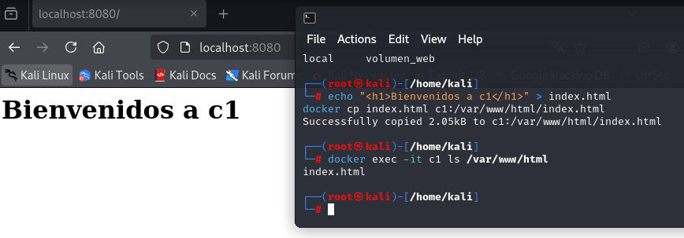
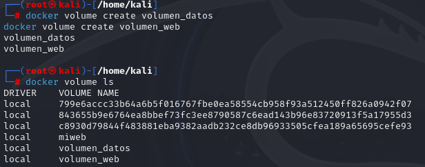
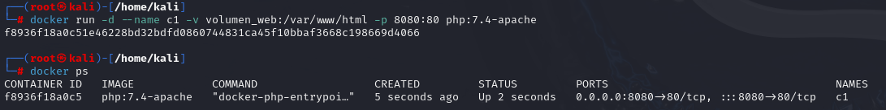
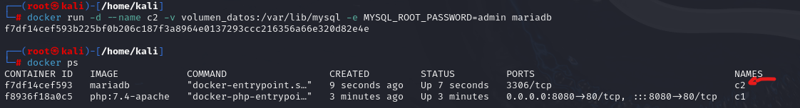
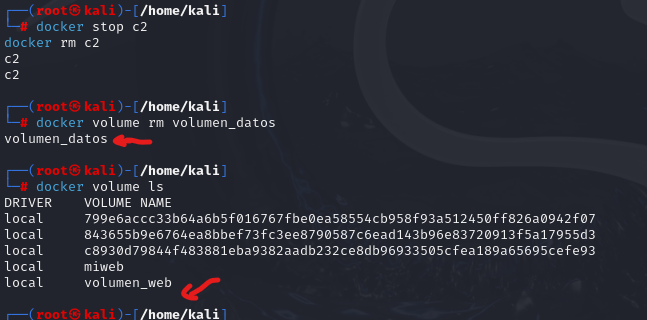
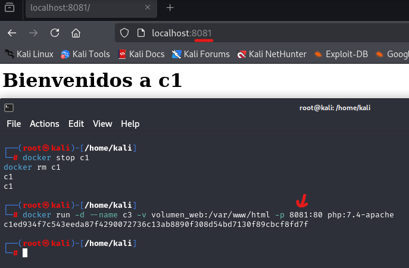
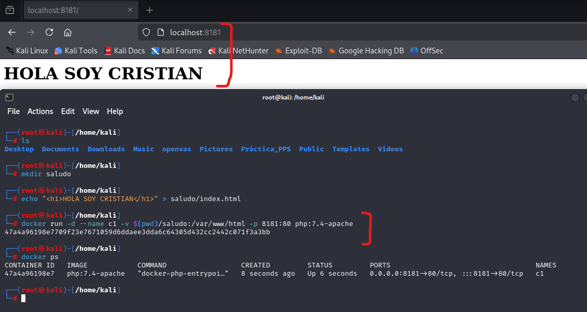
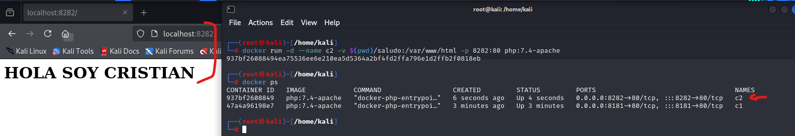
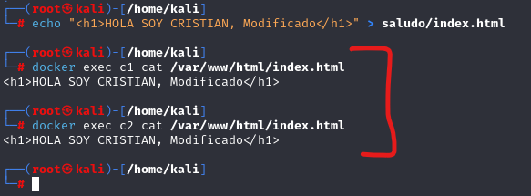
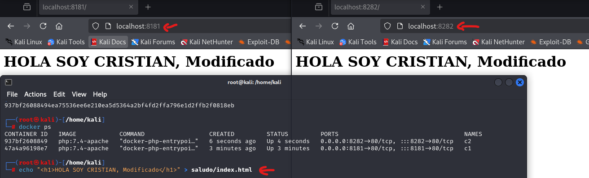

# Almacenamiento

El almacenamiento en Docker es fundamental para gestionar datos de forma persistente, incluso cuando los contenedores se detienen o eliminan. Docker ofrece varias formas de manejar el almacenamiento, dependiendo de las necesidades del usuario:

- Datos efímeros: Por defecto, los datos generados dentro de un contenedor se eliminan cuando este se detiene.
- Datos persistentes: Para conservar datos más allá del ciclo de vida de un contenedor, Docker permite utilizar volúmenes y bind mounts.

---

## Volúmenes en Docker

Los volúmenes son la forma recomendada por Docker para gestionar el almacenamiento persistente. Son gestionados directamente por Docker y ofrecen ventajas como:

- Independencia del sistema host: Los volúmenes no dependen de la estructura del sistema de archivos del host.
- Fácil manejo: Se crean, gestionan y comparten entre contenedores utilizando simples comandos de Docker.
- Almacenamiento en el sistema host: Los volúmenes se almacenan en una ubicación gestionada por Docker, generalmente en ``/var/lib/docker/volumes``.
- 
*Ejemplo de uso*: Un volumen puede ser montado dentro de un contenedor para almacenar datos de bases de datos, logs, o aplicaciones, asegurando que los datos persistan incluso si el contenedor es eliminado.

---

## Bind Mounts
Los bind mounts permiten conectar una carpeta o archivo específico del sistema de archivos del host a un contenedor. A diferencia de los volúmenes, los bind mounts dependen directamente de la ubicación del archivo o carpeta en el host.

- Mayor control: El usuario puede especificar exactamente qué directorios del host serán accesibles desde el contenedor.
- Acceso mutuo: Los cambios realizados en la carpeta del host se reflejan automáticamente dentro del contenedor (y viceversa).
- Flexibilidad: Son útiles para desarrollo local, ya que permiten compartir código y ver actualizaciones en tiempo real.

*Ejemplo de uso*: Un bind mount se utiliza comúnmente para compartir una carpeta de desarrollo con un contenedor de servidor web, permitiendo probar cambios sin reiniciar el contenedor.

---

## Comparación: Volúmenes vs. Bind Mounts

| **Aspecto**         | **Volúmenes**                            | **Bind Mounts**                          |
|----------------------|------------------------------------------|------------------------------------------|
| **Gestión**          | Gestionados por Docker                  | Gestionados por el usuario               |
| **Ubicación**        | En una ruta interna gestionada por Docker | En una carpeta específica del host       |
| **Facilidad de uso** | Más seguros y fáciles de compartir entre contenedores | Requieren especificar rutas absolutas    |
| **Flexibilidad**     | Diseñados para datos persistentes        | Útiles para desarrollo y configuración   |

Tanto los volúmenes como los bind mounts son herramientas poderosas que permiten personalizar

# Ejercicios Almacenamiento

- [Almacenamiento](#almacenamiento)
  - [Volúmenes en Docker](#volúmenes-en-docker)
  - [Bind Mounts](#bind-mounts)
  - [Comparación: Volúmenes vs. Bind Mounts](#comparación-volúmenes-vs-bind-mounts)
- [Ejercicios Almacenamiento](#ejercicios-almacenamiento)
  - [Ejercicio 1: Creación y Uso de Volúmenes](#ejercicio-1-creación-y-uso-de-volúmenes)
  - [Pantallazos para el ejercicio 1](#pantallazos-para-el-ejercicio-1)
  - [Ejercicio 2: Bind Mount para Compartir Datos](#ejercicio-2-bind-mount-para-compartir-datos)
  - [Pantallazos para el ejercicio 2](#pantallazos-para-el-ejercicio-2)


## Ejercicio 1: Creación y Uso de Volúmenes
El objetivo es crear un contenedor llamado web utilizando la imagen ``php:7.4-apache``, accesible desde el puerto ``8000``. Añadiremos los archivos ``index.html`` e ``index.php`` al directorio raíz del servicio web (``/var/www/html``).

1. **Creación de volúmenes**

Usamos el siguiente comando para crear y arrancar el contenedor. Primero, abrimos una terminal y ejecutamos las siguientes órdenes para crear los volúmenes:

   ```bash
docker volume create volumen_datos
docker volume create volumen_web
   ```

A continuación, verificamos que los volúmenes se han creado correctamente:

   ```bash
docker volume ls
   ```

2. **Arranque del contenedor ``c1``**

Creamos un contenedor basado en la imagen ``php:7.4-apache`` que utiliza el volumen ``volumen_web``:

   ```bash
   docker run -d --name c1 -v volumen_web:/var/www/html -p 8080:80 php:7.4-apache
   ```
Verificamos que el contenedor está en ejecución:

   ```bash
   docker ps
   ```

3. **Arranque del contenedor ``c2``**

Creamos un contenedor basado en la imagen ``mariadb`` que utiliza el volumen ``volumen_datos``:

   ```bash
   docker run -d --name c2 -v volumen_datos:/var/lib/mysql -e MYSQL_ROOT_PASSWORD=admin mariadb
   ```
Verificamos que el contenedor está en ejecución:

   ```bash
   docker ps
   ```

4. **Eliminación del volumen ``volumen_datos``**

Para borrar el volumen ``volumen_datos``, primero debemos detener y eliminar el contenedor ``c2``.

   ```bash
   docker stop c2
   docker rm c2
   ```
   Ahora intentamos borrar el volumen y verificamos que el volumen ha sido eliminado:

   ```bash
   docker volume rm volumen_datos
   docker volume ls
   ```

5. **Gestión del contenido en ``c1``**

Vamos a copiar o crear, en este caso crear, un archivo ``index.html`` dentro del contenedor ``c1`` y verificamos su funcionalidad:

   ```bash
   echo "<h1>Bienvenidos a c1</h1>" > index.html
   docker cp index.html c1:/var/www/html/index.html
   ```
   Accedemos al contenedor y verificamos el archivo:
   ```bash
   docker exec -it c1 ls /var/www/html
   ```   
Ahora, accedemos desde un navegador a ``http://localhost:8080`` para comprobar que el contenido es visible.

<p align="center">
    
    </p>
<p align="center"><em>Gestión de archivo index.html</em></p>


6. **Creación y configuración de ``c3``**

Eliminamos el contenedor ``c1`` y creamos uno nuevo, ``c3``, con las mismas características pero sirviendo en el puerto ``8081``.

   ```bash
   # Eliminamos el contenedor c1
   docker stop c1
   docker rm c1
   ```
   Creamos el contenedor ``c3``:
   ```bash
   docker run -d --name c3 -v volumen_web:/var/www/html -p 8081:80 php:7.4-apache
   ```
Por último, accedemos al contenedor desde un navegador en la dirección ``http://localhost:8081`` y verificamos el contenido.

## Pantallazos para el ejercicio 1

- **Pantallazo con los dos volúmenes creados (docker volume ls):**
<p align="center">
    
    </p>
<p align="center"><em>Volumenes creados y visualizos (últimos 2)</em></p>

- **Pantallazo con el comando de creación de c1 y la ejecución de docker ps:**
<p align="center">
    
    </p>
<p align="center">Creación y visualización del contenedor c1<em></em></p>

- **Pantallazo con el comando de creación de c2 y la ejecución de docker ps.**
<p align="center">
    
    </p>
<p align="center">Creación y visualización del contenedor c2<em></em></p>

- **Pantallazo con el proceso de borrado del volumen volumen_datos:**
<p align="center">
    
    </p>
<p align="center">Pasos de parado del contenedor y posterior borrado del volumen<em></em></p>

- **Pantallazo con el borrado de c1, la creación de c3 y acceso al contenedor c3:**
<p align="center">
    
    </p>
<p align="center">Borrado de c1, creación de c3 y acceso al contenedor<em></em></p>

## Ejercicio 2: Bind Mount para Compartir Datos
En este ejercicio, configuraremos dos contenedores basados en la imagen ``php:7.4-apache`` utilizando un **bind mount** para compartir una carpeta del host con los contenedores. Modificaremos el contenido del archivo en el host para verificar que los cambios se reflejan automáticamente en los contenedores sin necesidad de reiniciarlos.

1. **Creación de la carpeta ``saludo``**

Creamos la carpeta ``saludo`` y el archivo ``index.html``:

   ```bash
mkdir saludo
echo "<h1>HOLA SOY CRISTIAN</h1>" > saludo/index.html
   ```

2. **Arranque de los contenedores con Bind Mount**

Creamos el contenedor ``c1`` montando la carpeta ``saludo`` en ``/var/www/html`` y sirviendo en el puerto ``8181``:

   ```bash
   docker run -d --name c1 -v $(pwd)/saludo:/var/www/html -p 8181:80 php:7.4-apache
   ```
Descripción del comando:

- ``-d``: Ejecuta el contenedor en segundo plano.
- ``--name c1``: Asigna el nombre c1 al contenedor.
- ``-v $(pwd)/saludo:/var/www/html``: Realiza un bind mount entre la carpeta saludo del host y /var/www/html del contenedor.
- ``-p 8181:80``: Expone el puerto 8181 en el host, mapeándolo al puerto 80 del contenedor.
- ``php:7.4-apache``: Usa la imagen del servidor PHP con Apache.

> **Nota**: Cabe resaltar que si no nos encontramos en el directorio en el que tenemos la carpeta donde almacenaremos el bind mount, debemos incluir la ruta completa.

Luego, Creamos el contenedor ``c2`` con la misma carpeta pero sirviendo en el puerto ``8282``:

   ```bash
   docker run -d --name c2 -v $(pwd)/saludo:/var/www/html -p 8282:80 php:7.4-apache
   ```
Este comando es similar al anterior, pero utiliza el puerto ``8282`` y asigna el nombre ``c2``. 

3. **Modificación del contenido del archivo**

Modificamos el archivo ``index.html`` en el host:

   ```bash
   echo "<h1>HOLA SOY XXXXX CAMBIADO</h1>" > saludo/index.html
   ```

Por último, verificamos que los cambios se reflejan automáticamente accediendo a los contenedores en los puertos ``8181`` y ``8282``.

## Pantallazos para el ejercicio 2

- **Comando de creación del contenedor c1 (puerto 8181):**
<p align="center">
    
    </p>
<p align="center"><em>Pasos para creación del contenedor c1 con Bind Mount</em></p>

- **Comando de creación del contenedor c2 (puerto 8282):**
<p align="center">
    
    </p>
<p align="center"><em>Pasos para creación del contenedor c2 con Bind Mount</em></p>

- **Acceso al contenido de index.html en ambos contenedores:**
<p align="center">
    
    </p>
<p align="center"><em>Visualización del contenido del archivo index.html dentro de ambos contenedores</em></p>

- **Acceso a los contenedores después de modificar el archivo index.html:**

<p align="center">
    
    </p>
<p align="center"><em>Muesra visual de la modificación del contenido html</em></p>