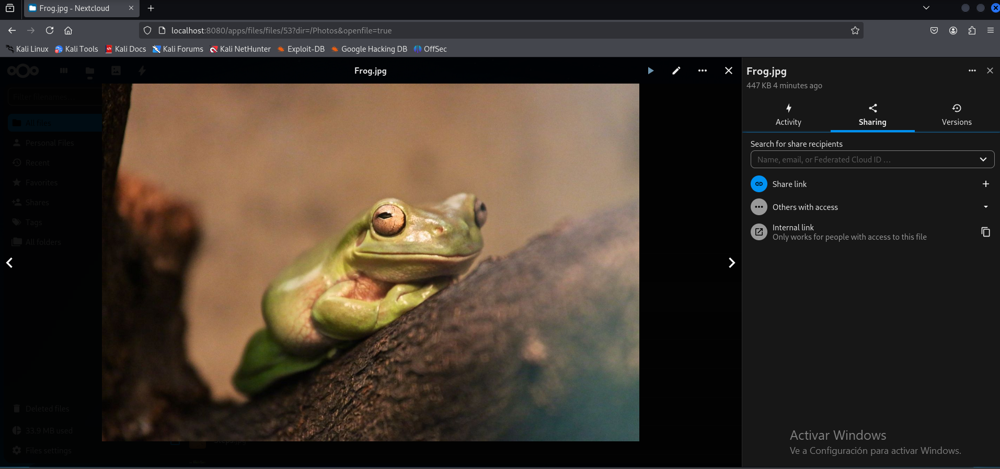

# Redes
## Introducción a redes docker
Docker es una plataforma que permite crear, desplegar y ejecutar aplicaciones en contenedores. Cada contenedor es una instancia aislada, pero muchas aplicaciones requieren comunicación con otros contenedores o con el mundo exterior. Aquí es donde entran en juego las redes en Docker.

Docker proporciona un sistema de redes incorporado que permite a los contenedores conectarse entre sí o a redes externas. Las redes en Docker son fundamentales para garantizar la conectividad, la seguridad y la escalabilidad de las aplicaciones desplegadas.

---

## Tipos de Redes en Docker

Docker proporciona diferentes tipos de redes para manejar la conectividad de los contenedores. A continuación se describen los tipos más comunes:

1. **Bridge (Red por defecto)**
   - Tipo de red predeterminada al crear un contenedor si no se especifica otra.
   - Permite la comunicación entre contenedores en el mismo host.
   - Ideal para aplicaciones aisladas.
  
2. **Host**
   - El contenedor comparte la red del sistema anfitrión.
   - Ofrece mayor rendimiento al eliminar la sobrecarga de red virtual.
   - No proporciona aislamiento de red.

3. **None**
   - Deshabilita completamente la conectividad de red del contenedor.
   - Útil para pruebas o contenedores que no requieren conectividad.

4. **Overlay**
   - Se utiliza en entornos de Docker Swarm.
   - Permite la comunicación entre contenedores distribuidos en múltiples hosts.
   - Ideal para aplicaciones distribuidas.

5. **Macvlan**
   - Asigna a cada contenedor una dirección MAC única, haciendo que aparezca como un dispositivo en la red física.
   - Útil para casos donde los contenedores necesitan interactuar directamente con la red física.

6. **Redes Personalizadas**
   - Puedes crear redes personalizadas con configuraciones específicas:
     - Rangos de direcciones IP.
     - Subredes.
     - Control avanzado de tráfico.


# Ejercicios Redes

- [Redes](#redes)
  - [Introducción a redes docker](#introducción-a-redes-docker)
  - [Tipos de Redes en Docker](#tipos-de-redes-en-docker)
- [Ejercicios Redes](#ejercicios-redes)
  - [Ejercicio 1: Trabajar con redes docker](#ejercicio-1-trabajar-con-redes-docker)
  - [Ejercicio 2: Despliegue de Nextcloud + mariadb/postgreSQL](#ejercicio-2-despliegue-de-nextcloud--mariadbpostgresql)


## Ejercicio 1: Trabajar con redes docker
En este ejercicio, configuraremos redes Docker de tipo ``bridge`` y conectaremos dos contenedores a estas redes. Verificaremos la conectividad entre ellos y realizaremos ajustes para permitir comunicación cruzada al final del ejercicio.

1. **Creación de las redes**

Creamos la red ``red1`` con configuración personalizada:

   ```bash
   docker network create \
     --driver bridge \
     --subnet=172.28.0.0/16 \
     --gateway=172.28.0.1 \
     red1
   ```

A continuación, verificamos que la red se ha creado correctamente:

   ```bash
docker network ls
   ```

Luego, creamos la red ``red2`` con configuración automática

   ```bash
docker network create --driver bridge red2
   ```
Verificamos ambas redes con:
   ```bash
docker network inspect red1
docker network inspect red2
   ```

<p align="center">
    
    </p>
<p align="center"><em>Inspeccionar redes creadas</em></p>


2. **Crear y configurar el contenedor ``u1``**

Creamos el contenedor ``u1`` conectado a la red ``red1`` con una IP fija y hostname ``host1``:

   ```bash
   docker run -dit --name u1 \
     --network red1 \
     --ip 172.28.0.10 \
     --hostname host1 \
     ubuntu:20.04
   ```
Entramos en el contenedor ``u1``:

   ```bash
   docker exec -it u1 bash
   ```
Dentro del contenedor, instalamos la herramienta `ping` y el paquete ``iproute2``, que no viene preinstalado en las imágenes base de Ubuntu:
   ```bash
   apt update && apt install -y inetutils-ping && apt install -y iproute2
   ```
Verificamos la configuración de red del conetendor `u1`:
   ```bash
   ip a
   ```

<p align="center">
    
    </p>
<p align="center"><em>Configuración de red del contenedor u1</em></p>


3. **Crear y configurar el contenedor ``u2``**

Creamos el contenedor ``u2`` conectado a la red ``red2``, dejando que Docker asigne automáticamente la IP y configurando el hostname ``host2``:

   ```bash
   docker run -dit --name u2 \
     --network red2 \
     --hostname host2 \
     ubuntu:20.04
   ```
Realizamos la misma configuración que con el contenedor `u1` y verificamos la configuración de red de:

<p align="center">
    
    </p>
<p align="center"><em>Configuración de red del contenedor u2</em></p>


4. **Verificar la falta de conectividad**

Desde ``u1``, intentamos hacer ping al contenedor ``u2`` tanto por IP como por nombre.

   ```bash
   ping host2
   ping [IP_asignada_a_u2]
   ```
Luego, Desde ``u2``, intentamos hacer ping al contenedor ``u1`` tanto por IP como por nombre:

   ```bash
   ping host1
   ping 172.28.0.10
   ```

<p align="center">
    
    </p>
<p align="center"><em>Verificación de que no hay conectividad entre contenedores</em></p>

5. **Conectar ``u1`` a ``red2`` y probar conectividad**

Conectamos el contenedor ``u1`` a la red ``red2``:

   ```bash
   docker network connect red2 u1
   ```
Desde ``u1``, intentamos hacer ping al contenedor ``u2`` nuevamente:
   ```bash
   ping host2
   ping [IP_asignada_a_u2]
   ```
Ahora, desde ``u2``, intentamos hacer ping al contenedor ``u1`` nuevamente:

   ```bash
   ping host1
   ping 172.28.0.10
   ```

> **Nota**: Aunque u1 tiene acceso a ``red2``, ``u2`` no tiene ninguna ruta para alcanzar ``red1``, lo que impide que pueda enviar paquetes a la IP de ``u1`` en la red 172.28.0.0/16. Para que ``u2`` pueda hacer ping a ``u1``, debes conectar ``u2`` también a ``red1``.

<p align="center">
    
    </p>
<p align="center"><em>Verificación de que ya hay conectividad entre contenedores</em></p>


## Ejercicio 2: Despliegue de Nextcloud + mariadb/postgreSQL
En este ejercicio, desplegaremos la aplicación Nextcloud junto con una base de datos utilizando Docker. La base de datos será configurada con ``mariadb:10.5``. Implementaremos almacenamiento persistente mediante volúmenes y conectaremos ambos servicios en una red de tipo ``bridge``.

1. **Crear la red Docker**

Creamos una red de tipo ``bridge`` para conectar los contenedores de Nextcloud y MariaDB y verificamos que la red se ha creado correctamente:

   ```bash
docker network create nextcloud-net
docker network ls
   ```
   
<p align="center">
    
    </p>
<p align="center"><em>Creación de la red Nextcloud-net</em></p>


2. **Crear el contenedor de la base de datos**

Creamos un volumen para almacenar los datos de la base de datos de forma persistente:

   ```bash
   docker volume create db-data
   ```
Creamos el contenedor de MariaDB:
   ```bash
   docker run -d --name nextcloud-db \
     --network nextcloud-net \
     -v db-data:/var/lib/mysql \
     -e MYSQL_ROOT_PASSWORD=admin \
     -e MYSQL_DATABASE=nextcloud \
     -e MYSQL_USER=nextcloud_user \
     -e MYSQL_PASSWORD=nextcloud_pass \
     mariadb:10.5
   ```
Descripción del comando:
- ``--name nextcloud-db``: Nombre del contenedor.
- ``--network nextcloud-net``: Conecta el contenedor a la red nextcloud-net.
- ``-v db-data:/var/lib/mysql``: Asigna el volumen db-data al directorio de datos de MariaDB.
- Varianles de entorno configuradas:
  - ``MYSQL_ROOT_PASSWORD``: Contraseña del usuario root.
  - ``MYSQL_DATABASE``: Nombre de la base de datos.
  - ``MYSQL_USER``: Usuario de la base de datos.
  - ``MYSQL_PASSWORD``: Contraseña para el usuario de la base de datos.

Verificamos que el contenedor está corriendo:
   ```bash
   docker ps
   ```

<p align="center">
    
    </p>
<p align="center"><em>Creación del contenedor de la BBDD de Nextcloud</em></p>


3. **Crear el contenedor de Nextcloud**

Creamos un volumen para almacenar los datos de la aplicación Nextcloud:

   ```bash
   docker volume create nextcloud-data
   ```
Creamos el contenedor de MariaDB:
   ```bash
   docker run -d --name nextcloud \
     --network nextcloud-net \
     -v nextcloud-data:/var/www/html \
     -e MYSQL_HOST=nextcloud-db \
     -e MYSQL_DATABASE=nextcloud \
     -e MYSQL_USER=nextcloud_user \
     -e MYSQL_PASSWORD=nextcloud_pass \
     -p 8080:80 \
     nextcloud
   ```
Descripción del comando:
- ``--name nextcloud``: Nombre del contenedor.
- ``--network nextcloud-net``: Conecta el contenedor a la red nextcloud-net.
- ``-v nextcloud-data:/var/www/html``: Asigna el volumen nextcloud-data al directorio de datos de Nextcloud
- Varianles de entorno configuradas:
   - ``MYSQL_HOST``: Nombre del contenedor de la base de datos (en este caso, nextcloud-db).
   - ``MYSQL_DATABASE``: Nombre de la base de datos.
   - ``MYSQL_USER``: Usuario de la base de datos.
   - ``MYSQL_PASSWORD``: Contraseña del usuario de la base de datos.
- ``-p 8080:80``: Expone el puerto 8080 en el host, mapeándolo al puerto 80 del contenedor.

<p align="center">
    
    </p>
<p align="center"><em>Creación del contenedor de aplicación de Nextcloud</em></p>


Verificamos que el contenedor está corriendo:
   ```bash
   docker ps
   ```

4. **Configurar y acceder a Nextcloud**

Abrimos un navegador y accedemos a la aplicación Nextcloud utilizando la dirección
   ```plaintext
   http://localhost:8080
   ```
Completamos el asistente de configuración inicial:
- Indicamos el nombre del usuario administrador y su contraseña.
- Verificamos que la conexión a la base de datos es exitosa.
- Continuamos con la configuración hasta llegar al escritorio de Nextcloud.

<p align="center">
    
    </p>
<p align="center"><em>Acceso a la aplicación de Nextcloud desde navegador</em></p>

<p align="center">
    
    </p>
<p align="center"><em>Acceso al escritorio de la aplicación, conexión con BBDD efectiva</em></p>

<p align="center">
    
    </p>
<p align="center"><em>Acceso archivo de la BBDD</em></p>