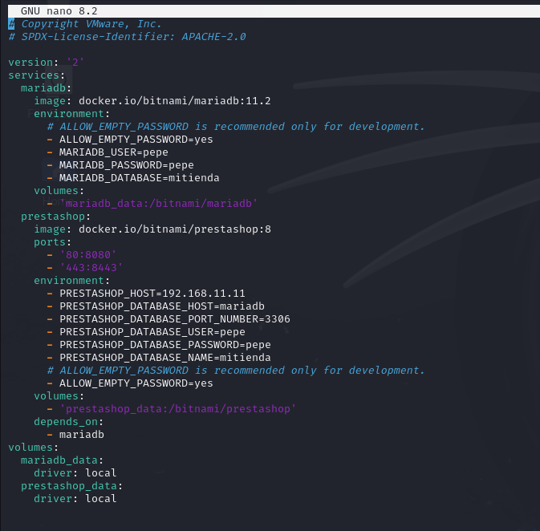
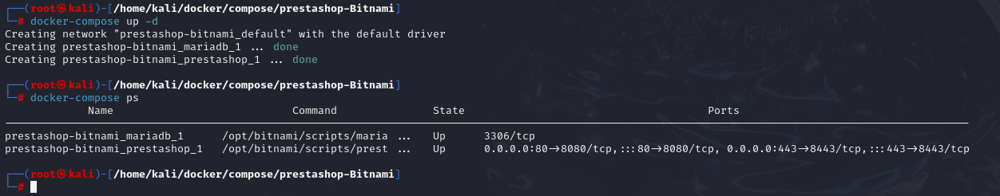
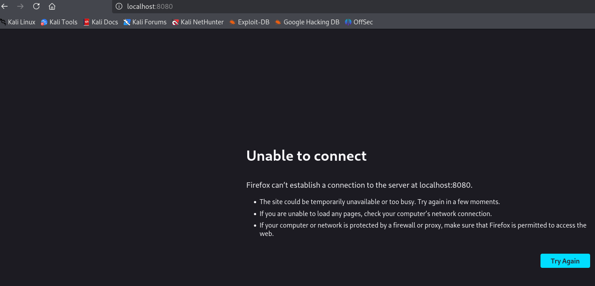
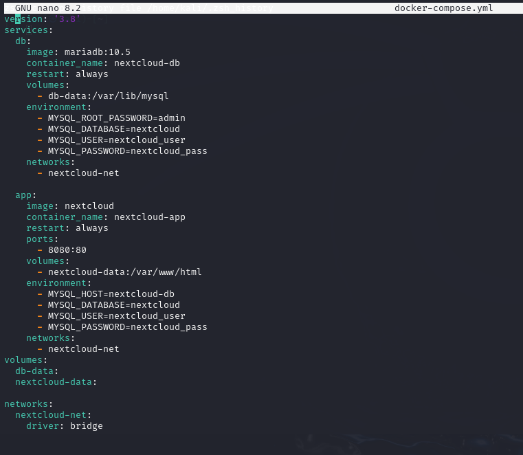
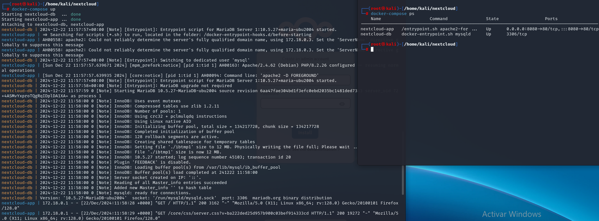
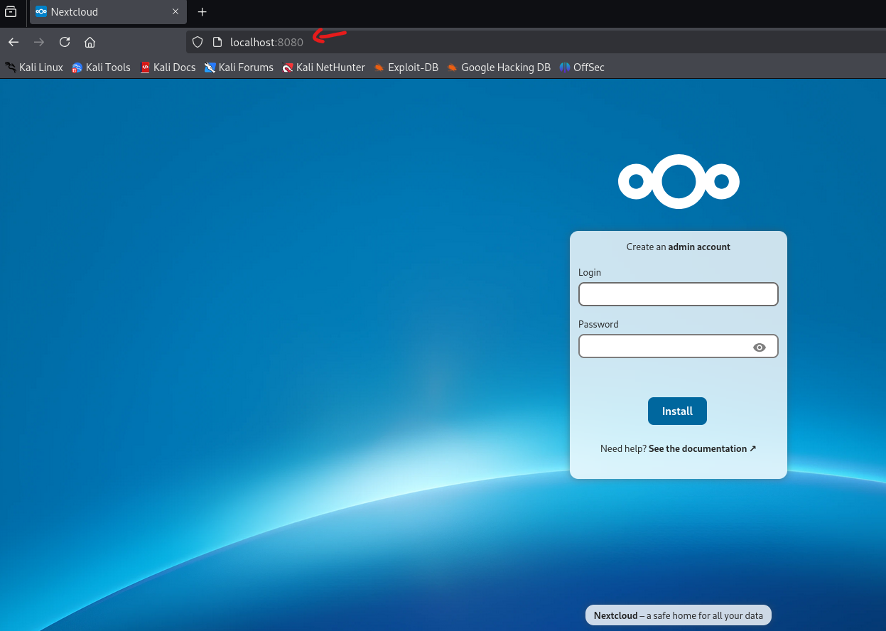

# Escenarios multicontenedor
En el mundo del desarrollo y despliegue de aplicaciones modernas, muchas soluciones no son monolíticas, sino que están compuestas por múltiples servicios que trabajan juntos. Por ejemplo, una aplicación web típica puede consistir en un servidor backend, una base de datos, un servidor de caché, y quizás algún sistema de mensajería. Administrar, configurar y coordinar todos estos servicios de manera eficiente puede convertirse en un desafío. Aquí es donde Docker Compose se convierte en una herramienta indispensable.

Docker Compose es una herramienta proporcionada por Docker que permite definir y ejecutar aplicaciones multicontenedor. Utilizando un archivo de configuración YAML, los desarrolladores pueden definir todos los servicios, redes y volúmenes necesarios para su aplicación. Con un simple comando, Docker Compose crea y gestiona todos los contenedores, redes y volúmenes especificados, simplificando el flujo de trabajo y asegurando que todos los servicios estén configurados correctamente.

---

# Ejercicios Despligues multicontenedor

- [Escenarios multicontenedor](#escenarios-multicontenedor)
- [Ejercicios Despligues multicontenedor](#ejercicios-despligues-multicontenedor)
  - [Ejercicio 1: Despliegue de prestashop](#ejercicio-1-despliegue-de-prestashop)
  - [Ejercicio 2: Despliegue de Nextcloud](#ejercicio-2-despliegue-de-nextcloud)


## Ejercicio 1: Despliegue de prestashop
En esta práctica desplegaremos una tienda virtual basada en PrestaShop utilizando un archivo ``docker-compose.yml`` de Bitnami. Modificaremos el archivo según los requisitos y configuraremos variables de entorno específicas.

1. **Modificar el archivo ``docker-compose.yml``**

El archivo docker-compose.yml proporcionado por Bitnami para desplegar PrestaShop se encuentra en la página oficial de Docker Hub para la imagen bitnami/prestashop. Este archivo define los servicios necesarios para ejecutar PrestaShop junto con una base de datos MariaDB. El archivo original es este, asegurandonos datos como nuestra ip y los usuarios con sus contraseñas:

   ```yaml
version: '2'
services:
  mariadb:
    image: docker.io/bitnami/mariadb:11.2
    environment:
      # ALLOW_EMPTY_PASSWORD is recommended only for development.
      - ALLOW_EMPTY_PASSWORD=yes
      - MARIADB_USER=pepe
      - MARIADB_PASSWORD=pepe
      - MARIADB_DATABASE=mitienda
    volumes:
      - 'mariadb_data:/bitnami/mariadb'
  prestashop:
    image: docker.io/bitnami/prestashop:8
    ports:
      - '80:8080'
      - '443:8443'
    environment:
      - PRESTASHOP_HOST=192.168.11.11
      - PRESTASHOP_DATABASE_HOST=mariadb
      - PRESTASHOP_DATABASE_PORT_NUMBER=3306
      - PRESTASHOP_DATABASE_USER=pepe
      - PRESTASHOP_DATABASE_PASSWORD=pepe
      - PRESTASHOP_DATABASE_NAME=mitienda
      # ALLOW_EMPTY_PASSWORD is recommended only for development.
      - ALLOW_EMPTY_PASSWORD=yes
    volumes:
      - 'prestashop_data:/bitnami/prestashop'
    depends_on:
      - mariadb
volumes:
  mariadb_data:
    driver: local
  prestashop_data:
    driver: local
   ```

<p align="center">
    
    </p>
<p align="center"><em>Configuración del docker-compose para la aplicación Prestashop</em></p>


1. **Levantar el escenario con Docker Compose**

Ejecutamos los siguientes comandos para desplegar los contenedores y verificar que estén funcionando:

   ```bash
   docker-compose up -d    #Para indicar que se levante en segundo plano como demonio
   docker-compose ps
   ```

<p align="center">
    
    </p>
<p align="center"><em>Prestashop funcionando</em></p>


3. **Acceder a la aplicación**

Abrimos un navegador web e ingresamos la dirección IP de la máquina (o ``localhost``) y el puerto correspondiente para acceder a PrestaShop:

   ```arduino
   http://localhost:8080
   ```

<p align="center">
    
    </p>
<p align="center"><em>Comprobación del contenedor creado con docker_compose</em></p>

> **Nota**: En este caso, deberiamos ver la interfaz de Prestashop y que funcionase tanto la aplicación como la base de datos de la página

## Ejercicio 2: Despliegue de Nextcloud
En esta práctica desplegaremos Nextcloud con una base de datos (MariaDB o PostgreSQL) utilizando Docker Compose. Configuraremos persistencia y variables de entorno necesarias.

1. **Crear el archivo ``docker-compose.yml``**

Creamos un directorio para el proyecto y entramos en él:

   ```bash
   mkdir nextcloud && cd nextcloud
   ```

Luego. creamos el archivo ``docker-compose.yml`` con un editor de texto, como ``nano``, con `nano docker-compose.yml` y escribimos:

   ```yaml
   version: '3.8'
   services:
     db:
       image: mariadb:10.5
       container_name: nextcloud-db
       restart: always
       volumes:
         - db-data:/var/lib/mysql
       environment:
         - MYSQL_ROOT_PASSWORD=admin
         - MYSQL_DATABASE=nextcloud
         - MYSQL_USER=nextcloud_user
         - MYSQL_PASSWORD=nextcloud_pass
       networks:
      - nextcloud-net

     app:
       image: nextcloud
       container_name: nextcloud-app
       restart: always
       ports:
         - 8080:80
       volumes:
         - nextcloud-data:/var/www/html
       environment:
         - MYSQL_HOST=nextcloud-db
         - MYSQL_DATABASE=nextcloud
         - MYSQL_USER=nextcloud_user
         - MYSQL_PASSWORD=nextcloud_pass
       networks:
         - nextcloud-net
   volumes:
     db-data:
     nextcloud-data:

   networks:
     nextcloud-net:
       driver: bridge

   ```

<p align="center">
    
    </p>
<p align="center"><em>Docker-compose aplicación de Nextcloud</em></p>


2. **Levantar el escenario con Docker Compose**

Ejecutamos los siguientes comandos para desplegar los contenedores y verificar que estén funcionando:

   ```bash
   docker-compose up -d    #Para indicar que se levante en segundo plano como demonio
   docker-compose ps
   ```

<p align="center">
    
    </p>
<p align="center"><em>Iniciar y verificar el funcionamiento del docker-compose</em></p>

> **Nota**: Para verificar que se han creado los volúmenes definidos (``db-data`` y ``nextcloud-data``) y la red de tipo ``bridge`` para los servicios:
>   ```bash
>   docker volume ls
>   docker network ls
>   ```

3. **Acceder a la aplicación**

Abrimos un navegador web e ingresamos la dirección IP de la máquina (o ``localhost``) y el puerto correspondiente para acceder a PrestaShop:

   ```arduino
   http://localhost:8080
   ```

<p align="center">
    
    </p>
<p align="center"><em>Verificación del funcionamiento desde l navegador</em></p>

> **Nota**: En caso de necesitar repetir el ejercicio, eliminamos el escenario y sus volúmenes con el siguiente comando:
>   ```bash
>   docker-compose down -v
>   ```