# Escenarios multicontenedor
En esta sesión, trabajaremos en la creación y gestión de imágenes **Docker**, un proceso fundamental para personalizar y desplegar aplicaciones o servicios de manera eficiente y reproducible. A través de dos enfoques, aprenderemos a generar imágenes tanto desde contenedores existentes como utilizando un **Dockerfile**.

Existen dos formas principales de crear imágenes **Docker**: a partir de un contenedor en ejecución y mediante un **Dockerfile**. La primera opción es más directa y manual, ya que parte de un contenedor existente donde se realizan configuraciones o instalaciones, y posteriormente se guarda el estado final como una nueva imagen usando ``docker commit``. Aunque es sencilla, esta metodología puede ser menos eficiente y reproducible, ya que depende de pasos manuales. Por otro lado, crear imágenes mediante un Dockerfile permite automatizar y documentar todo el proceso de construcción de la imagen. Con un archivo declarativo, se definen las instrucciones paso a paso, lo que facilita la consistencia, el mantenimiento y la replicación del proceso en cualquier entorno. En resumen, mientras que ``docker commit`` es útil para tareas rápidas o experimentales, el Dockerfile es la opción recomendada para producción por su flexibilidad y reproducibilidad.

---

# Ejercicios Despligues multicontenedor

- [Escenarios multicontenedor](#escenarios-multicontenedor)
- [Ejercicios Despligues multicontenedor](#ejercicios-despligues-multicontenedor)
  - [Ejercicio 1: Creación de una imagen a partir de un contenedor](#ejercicio-1-creación-de-una-imagen-a-partir-de-un-contenedor)
  - [Ejercicio 2: Creación de una imagen a partir de un Dockerfile](#ejercicio-2-creación-de-una-imagen-a-partir-de-un-dockerfile)


## Ejercicio 1: Creación de una imagen a partir de un contenedor
En esta práctica el objetivo será crear una imagen Docker a partir de un contenedor, subirla a Docker Hub y descargarla en otro sistema o borrarla y volverla a descargar en el mismo sistema.

1. **Crear un contenedor desde una imagen base**

Primero arrancamos un contenedor basado en la imagen ``ubuntu``.
  ```bash
  docker run -dit --name red-tools ubuntu
  ```
Luego, entramos al contenedor en ejecución:
  ```bash
  docker exec -it red-tools bash
  ```

<p align="center">
    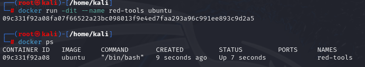
    </p>
<p align="center"><em>Creación del contenedor de red rools</em></p>

2. **Instalar las herramientas de red**

Dentro del contenedor, instalamos las herramientas necesarias:
  ```bash
  apt update
  apt install -y inetutils-ping iproute2 dnsutils
  ```

> **Nota**: Podemos verificar que los comandos están instalados correctamente con:
>   - ping --help
>   - ip a
>   - nslookup
> <p align="center">
>  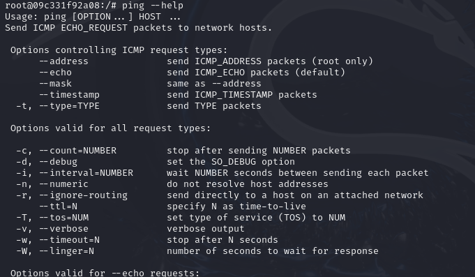
  </p>

3. **Crear una imagen a partir del contenedor**

Salimos del contenedor y creamos una imagen a partir de él usando el siguiente comando:
  ```bash
  docker commit red-tools clealg01/comando_redes
  ```

> **Nota**: en el comando, debe coincidir en el nombre de la imagen el *perfil_de_dockerHub*/*nombre_del_repositorio*

Podemos verificar que la imagen se ha creado de esta manera:
  ```bash
  apt images
  ```

<p align="center">
    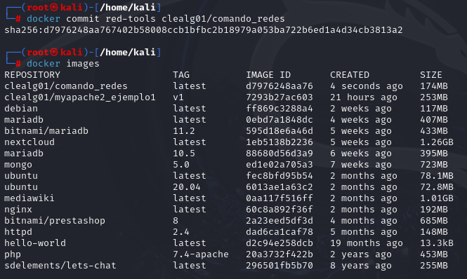
    </p>
<p align="center"><em>Creación de la imagen a partir del contenedor</em></p>

Una vez creada la imagen, creamos el repositorio en nuestra cuenta de DockerHub, vamos a *Repositories* > *Create New*:

<p align="center">
    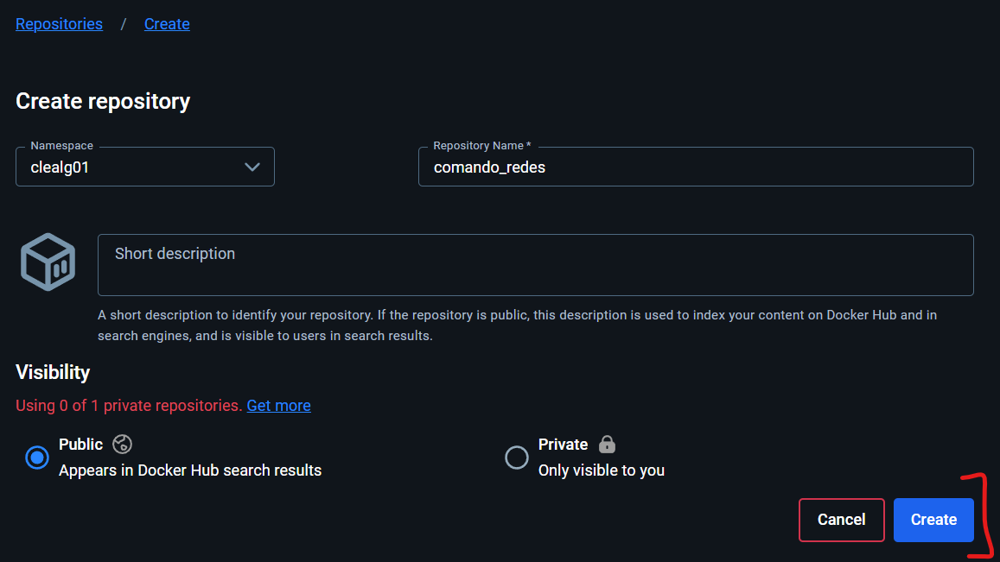
    </p>
<p align="center"><em>Creación del repositorio para subir la imagen</em></p>

4. **Subir la imagen a Docker Hub**

Nos autenticamos en Docker Hub, podemos hacerlo mediante token personal desde *My account* > *Settings* > *Personal access tokens* > *New access token*. Luego, creamos una e introducimos en docker el siguiente comando y como contraseña el token generado:
  ```bash
  docker login -u clealg01
  ```

<p align="center">
    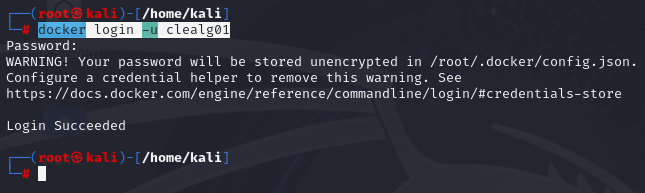
    </p>
<p align="center"><em>Login en mi perfil de DockerHub desde Linux</em></p>

Subimos la imagen a Docker Hub
  ```bash
  docker push clealg01/comando_redes
  ```

<p align="center">
    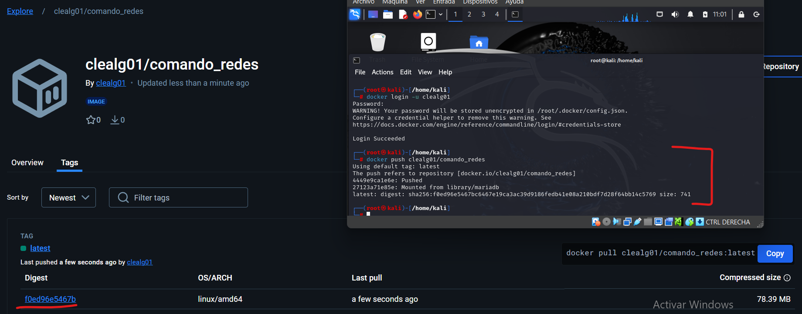
    </p>
<p align="center"><em>Subida de imagen al repositorio</em></p>

5. **Descargar la imagen y crear un nuevo contenedor**

Para simular que realizaremos la instalación en otro ordenador, eliminamos la imagen y el contenedor localmente:
  ```bash
  docker rmi clealg01/comando_redes
  docker rm -f red-tools
  ```
Para simular que realizaremos la instalación en otro ordenador, eliminamos la imagen localmente:
  ```bash
  docker pull clealg01/comando_redes
  ```
Creamos un nuevo contenedor a partir de la imagen descargada:
  ```bash
  docker run -dit --name red-tools-new clealg01/comando_redes
  ```
Por último, verificamos que el contenedor funciona correctamente:
  ```bash
  docker exec -it red-tools-new bash
  ping google.com
  ip a
  ```

<p align="center">
    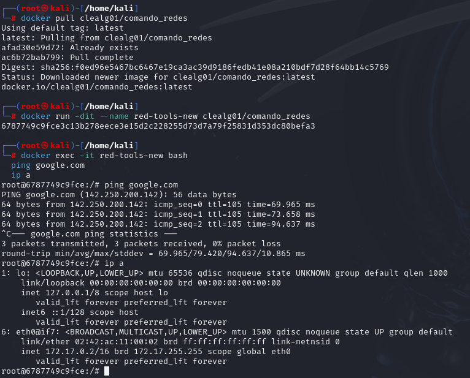
    </p>
<p align="center"><em>Simulación de la creación de un nuevo contenedor a partir de la imagen descargada de DockerHub</em></p>

## Ejercicio 2: Creación de una imagen a partir de un Dockerfile
En esta práctica crearemos una imagen Docker que sirva una página web estática usando un Dockerfile, la subiremos a Docker Hub y la descargaremos en otro sistema.

1. **Crear la página web estática**

Primero, creamos una carpeta para el servidor y entramos en ella:
  ```bash
  mkdir servidor_web && cd servidor_web
  ```

Luego, creamos con la herramienta ``nano`` el archivo ``index.html``. Añadimos el siguiente código:
  ```html
  <html>
    <head>
      <title>Mi Servidor Web</title>
    </head>
    <body>
      <h1>Bienvenidos al servidor web Docker de Cristian Leal<</h1>
    </body>
  </html>
  ```

2. **Creación archivo `Dockerfile`**

A continuación, creamos el ``Dockerfile`` en el mismo directorio y añadimos el siguiente contenido:
  ```bash
  FROM nginx:latest

  COPY index.html /usr/share/nginx/html/index.html

  EXPOSE 80
  ```

- ``FROM nginx:latest``: Utilizamos la imagen base de NGINX.
- ``COPY index.html``: Copiamos el archivo index.html a la carpeta de NGINX donde se sirven las páginas web.
- ``EXPOSE 80``: Exponemos el puerto 80 para acceder al servidor web.

<p align="center">
    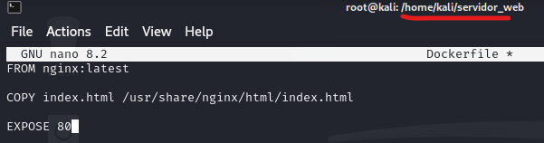
    </p>
<p align="center"><em>Contenido del archivo Dockerfile</em></p>

3. **Construir la imagen**

Construimos la imagen Docker usando el siguiente comando y verificamos:
  ```bash
  docker build -t clealg01/mi_servidor_web .
  docker images
  ```

<p align="center">
    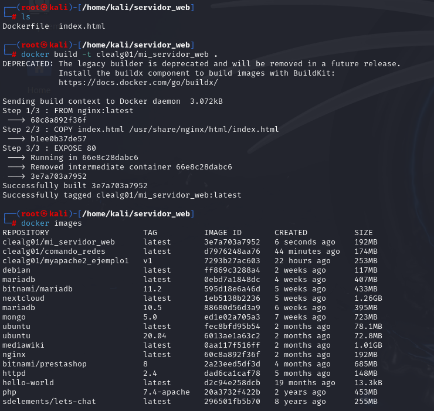
    </p>
<p align="center"><em>Creación de la imagen a partir del Dockerfile</em></p>

4. **Subir la imagen a Docker Hub**

Nos autenticamos en Docker Hub, podemos hacerlo mediante token personal desde *My account* > *Settings* > *Personal access tokens* > *New access token*. Luego, creamos una e introducimos en docker el siguiente comando y como contraseña el token generado:
  ```bash
  docker login -u clealg01
  ```

<p align="center">
    
    </p>
<p align="center"><em>Login en mi perfil de DockerHub desde Linux</em></p>

Subimos la imagen a Docker Hub
  ```bash
  docker push clealg01/mi_servidor_web
  ```

<p align="center">
    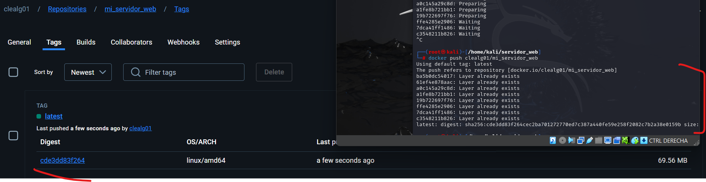
    </p>
<p align="center"><em>Subida de imagen al repositorio</em></p>


5. **Descargar la imagen y crear un nuevo contenedor**

Para simular que realizaremos la instalación en otro ordenador, eliminamos la imagen localmente:
  ```bash
  docker rmi clealg01/mi_servidor_web
  ```
Para simular que realizaremos la instalación en otro ordenador, eliminamos la imagen localmente:
  ```bash
  docker pull clealg01/mi_servidor_web
  ```
Creamos un nuevo contenedor a partir de la imagen descargada:
  ```bash
  docker run -d --name servidor-web -p 8080:80 clealg01/mi_servidor_web
  ```
Por último, verificamos que el contenedor funciona correctamente:

   ```arduino
   http://localhost:8080
   ```

<p align="center">
    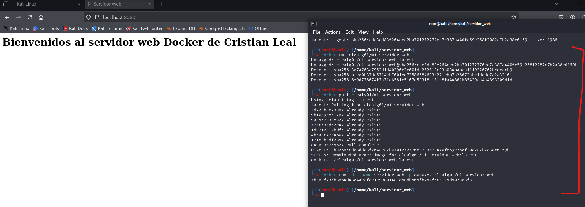
    </p>
<p align="center"><em>Comandos y verificación para la creación de la máquina a partir de la imagen descargada de DockerHub</em></p>